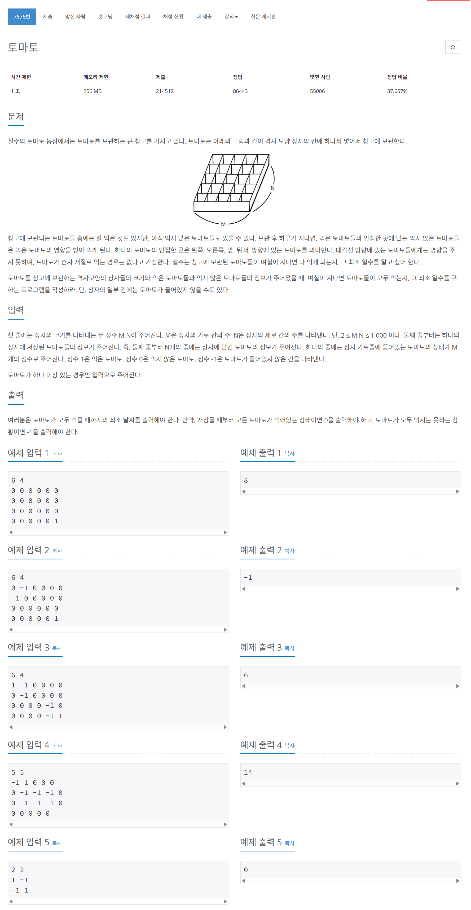

# 문제



# 코드
```
#include <iostream>
#include <vector>
#include <queue>

int main() 
{
  int M, N;
  std::cin >> M >> N;
  std::vector<std::vector<int>> vector_box(N, std::vector<int>(M));
  std::queue<std::pair<int, std::pair<int, int>>> queue_riping_tomato;
  int unripen_tomato = 0;
  for (int i = 0; i < N; i++)
  {
    for (int j = 0; j < M; j++)
    {
      int tomato;
      std::cin >> tomato;
      vector_box[i][j] = tomato;
      if (tomato == 1)
      {
        queue_riping_tomato.push({0, {i, j}});
      }
      else if (tomato == 0)
      {
        unripen_tomato++;
      }
    }
  }

  int day = 0;
  int y[4] = {1, -1, 0, 0};
  int x[4] = {0, 0, 1, -1};
  while (!queue_riping_tomato.empty())
  {
    int date_now = queue_riping_tomato.front().first;
    std::pair<int, int> tomato_now = queue_riping_tomato.front().second;
    queue_riping_tomato.pop();
    for (int i = 0; i < 4; i++)
    {
      if ((tomato_now.first + y[i] > -1 && tomato_now.first + y[i] < N) && (tomato_now.second + x[i] > -1 && tomato_now.second + x[i] < M) && vector_box[tomato_now.first + y[i]][tomato_now.second + x[i]] == 0)
      {
        queue_riping_tomato.push({date_now + 1, {tomato_now.first + y[i], tomato_now.second + x[i]}});
        vector_box[tomato_now.first + y[i]][tomato_now.second + x[i]] = 1;
        unripen_tomato--;
        if (date_now + 1 > day)
        {
          day = date_now + 1;
        }
      }
    }
  }
  
  if (unripen_tomato > 0)
  {
    std::cout << "-1" << std::endl;
  }
  else
  {
    std::cout << day << std::endl;
  }
  return 0;
}
```

# 풀이 과정
안익은 토마토가 남아있는지 어떻게 확인할까 고민하다가 맨 처음에 안익은 토마토 개수를 세어준 뒤  
익을 때 마다 하나씩 줄여 남아있는지 확인하였다.  
또한 지난 날을 확인하기 위해 day가 date의 최댓값을 갖도록 하였다.  
bfs로 들어오기 전에 안익은 토마토 개수가 0개이면 바로 리턴하는 방법도 좋아 보인다.  