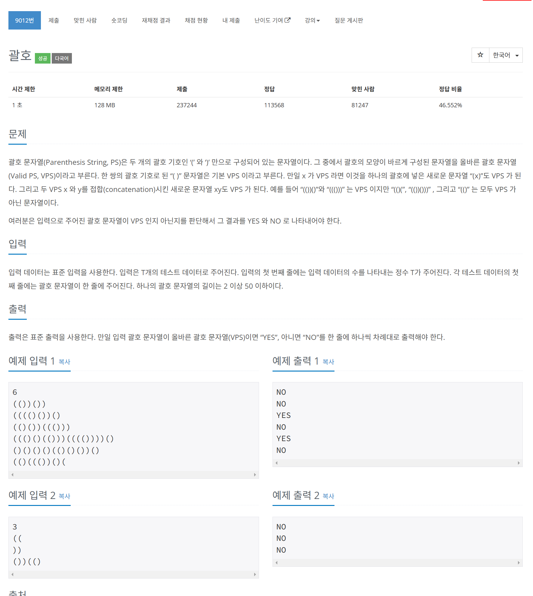

# 문제



# 코드
```
#include <iostream>
#include <stack>
#include <string>

int main() 
{
  int n;
  std::cin >> n;
  for (int i = 0; i < n; i++)
  {
    std::string str;
    std::cin >> str;
    std::stack<char> s;
    for (int j = 0; j < str.size(); j++)
    {
      if (str[j] == '(')
      {
        s.push(str[j]);
      }
      else if (str[j] == ')')
      {
        if (s.empty())
        {
          s.push(str[j]);
          break;
        }
        else
        {
          s.pop();
        }
      }
    }
    if (s.empty())
    {
      std::cout << "YES" << std::endl;
    }
    else
    {
      std::cout << "NO" << std::endl;
    }
  }
  return 0;
}
```

# 풀이 과정
옛날에 계산기를 만드는 프로그램에서  
중위 표기법을 후위 표기법으로 만드는 과정에서  
parenthesis validation check가 들어갔었던 것 같은 기억이 났다.  