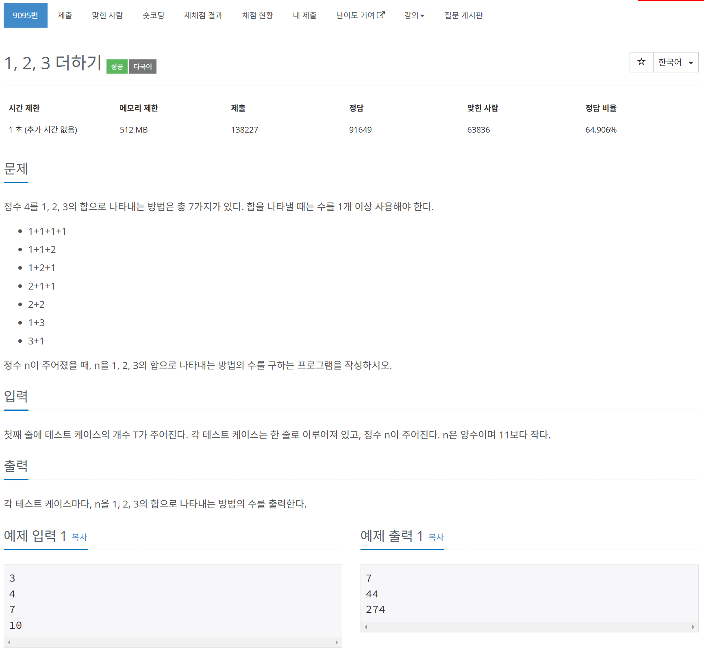

# 문제



# 코드
```
#include <iostream>

int CountWays(int number)
{
  if (number == 1) {
    return 1;
  }
  if (number == 2) {
    return 2;
  }
  if (number == 3) {
    return 4;
  }
  return CountWays(number - 1) + CountWays(number - 2) + CountWays(number - 3);
}

int main() 
{
  int number_count;
  std::cin >> number_count;
  int numbers[number_count];
  for (int i = 0; i < number_count; i++) {
    std::cin >> numbers[i];
  }
  for (int i = 0; i < number_count; i++) {
    std::cout << CountWays(numbers[i]) << std::endl;
  }
  return 0;
}
```

# 풀이 과정
한 개 이상이라고 문제에서 말했으나 연산이 들어가야만 하는 줄 알고 헤매었다.  
간단한 재귀로 풀었다.  