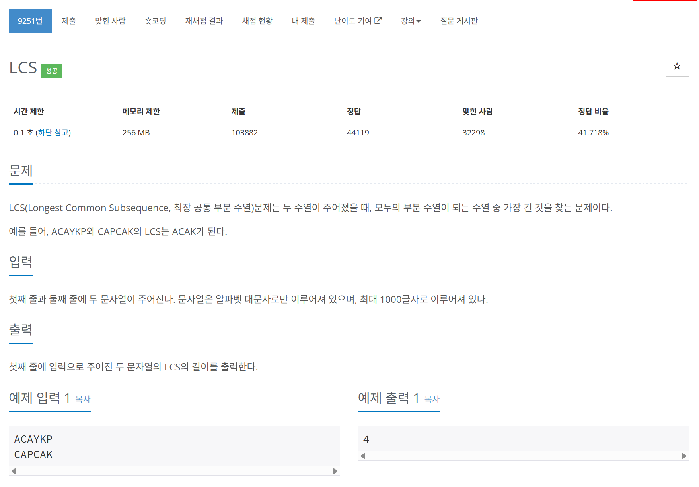

# 문제



# 코드
```
#include <iostream>
#include <string>
#include <algorithm>

int cache[1001][1001];

int LCS(std::string s1, std::string s2)
{
  int i, j;
  for (i = 0; i < s1.length(); i++)
  {
    for (j = 0; j < s2.length(); j++)
    {
      if (i == 0)
      {
        if (j == 0)
        {
          if (s1[i] == s2[j])
          {
            cache[i][j] = 1;
          }
        }
        else
        {
          if (s1[i] == s2[j])
          {
            cache[i][j] = 1;
          }
          else
          {
            cache[i][j] = cache[i][j - 1];
          }
        }
      }
      else
      {
        if (j == 0)
        {
          if (s1[i] == s2[j])
          {
            cache[i][j] = 1;
          }
          else if (cache[i - 1][0] != 0)
          {
            cache[i][j] = cache[i - 1][j];
          }
        }
        else
        {
          if (s1[i] == s2[j])
          {
            cache[i][j] = cache[i - 1][j - 1] + 1;
          }
          else
          {
            cache[i][j] = std::max(cache[i][j - 1], cache[i - 1][j]);
          }
        }
      }
    }
  }
  if (i == 0 || j == 0)
  {
    return 0;
  }
  return cache[i - 1][j - 1];
}

int main() 
{
  std::ios::sync_with_stdio(false);
  std::cin.tie(NULL);

  std::string s1, s2;
  std::cin >> s1;
  std::cin >> s2;
  std::cout << LCS(s1, s2) << "\n";
  return 0;
}
```

# 풀이 과정
현재의 요소와 같은 요소를 발견 했을 때와 발견하지 못했을 때  
이전의 자신이 구하던 길이의 값에 영향을 받을 것인지  
이전 요소가 구하던 길이의 값에 영향을 받을 것인지  
아니면 이전 요소가 이전에 구하던 길이의 값에 영향을 받을 것인지  
잘 판단해야 했던 문제였다.  
  
부딛혀보며 풀게 되었다.