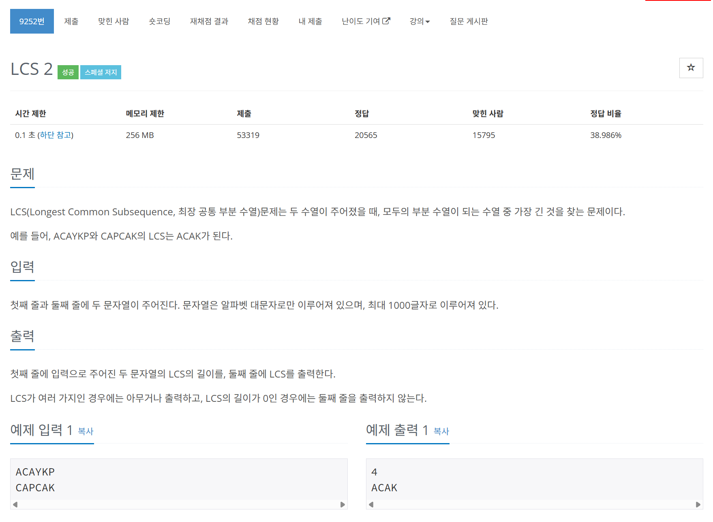

# 문제



# 코드
```
#include <iostream>
#include <vector>
#include <string>

using namespace std;

int main()
{
  vector<string> str_v;
  for (int i = 0; i < 2; i++)
  {
    string new_str;
    cin >> new_str;
    str_v.push_back(new_str);
  }
  int s1_size = str_v[0].length(), s2_size = str_v[1].length();
  vector<vector<pair<int, bool>> >lcs_v_v(s1_size + 1, vector<pair<int, bool> >(s2_size + 1, make_pair(0, false)));
  for (int i = 1; i <= s1_size; i++)
  {
    for (int j = 1; j <= s2_size; j++)
    {
      if (str_v[1][j - 1] == str_v[0][i - 1])
      {
        lcs_v_v[i][j].first = lcs_v_v[i - 1][j - 1].first + 1;
        lcs_v_v[i][j].second = true;
      }
      else
      {
        lcs_v_v[i][j].first = max(lcs_v_v[i][j - 1].first, lcs_v_v[i - 1][j].first);
      }
    }
  }

  cout << lcs_v_v[s1_size][s2_size].first << "\n";

  string result;
  int i = s1_size, j = s2_size;
  while (i > 0 && j > 0) 
  {
    if (str_v[0][i - 1] == str_v[1][j - 1]) {
      result = str_v[0][i - 1] + result;
      i--; j--;
    } else if (lcs_v_v[i - 1][j].first >= lcs_v_v[i][j - 1].first) {
      i--;
    } else {
      j--;
    }
  }
  if (!result.empty())
    cout << result << "\n";
  
  return 0;
}
```

# 풀이 과정
LCS는 일단 DP를 통해 2차원 배열로 풀었다.  
문자열을 복원하는게 핵심이었다.  
문자열 복원을 위해서는 역순으로 가야한다.  
우리는 DP를 할 때 윗칸과 옆칸을 보고 더 큰 걸 적었다.  
이를 이용해 맨 끝에서부터 움직이면서 윗칸과 옆칸 중 큰쪽으로 움직여가면 된다.  