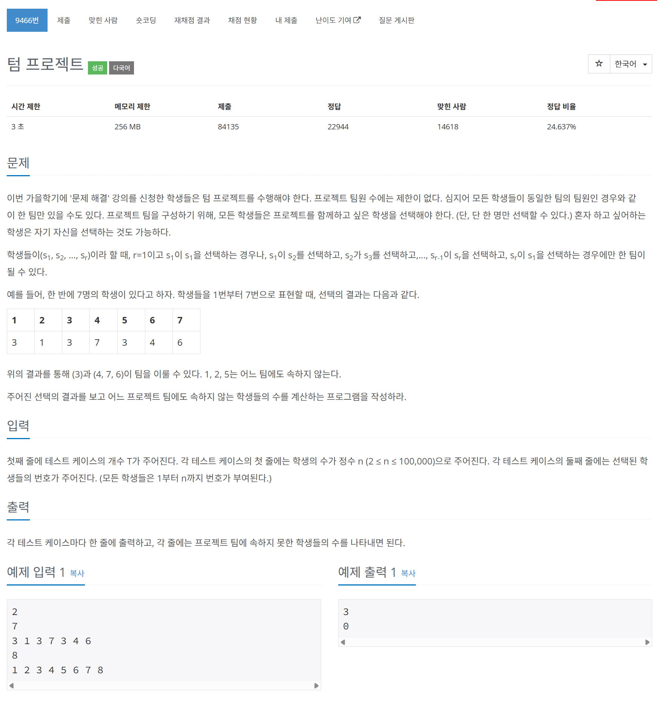

# 문제



# 코드
```
#include <iostream>
#include <vector>
#include <stack>

using namespace std;

int main()
{
  ios::sync_with_stdio(false);
  cin.tie(nullptr);

  int T;
  cin >> T;
  while (T-- > 0)
  {
    int n;
    cin >> n;
    vector<int> seleceted(n + 1, 0);
    for (int i = 1; i < n + 1; i++)
    {
      cin >> seleceted[i];
    }
    vector<bool> visited(n + 1, false);
    vector<bool> poped(n + 1, false);
    stack<int, deque<int> > stk;
    int size = 0;
    for (int i = 1; i < n + 1; i++)
    {
      int now = i;
      while (!visited[now])
      {
        stk.push(now);
        visited[now] = true;
        now = seleceted[now];
      }
      while (!poped[now])
      {
        int temp = stk.top();
        stk.pop();
        poped[temp] = true;
      }
      while (!stk.empty())
      {
        int temp = stk.top();
        stk.pop();
        poped[temp] = true;
        size++;
      }
    }
    cout << size << "\n";
  }
  return 0;
}
```

# 풀이 과정
DFS로 풀었다.  
stack을 통해 연결을 순차적으로 따라가며 넣다가,  
이미 방문을 한 노드가 나오면 순환인 곳까지 stack에서 pop한다.  
이후 남은 크기를 모두 더 한다.  